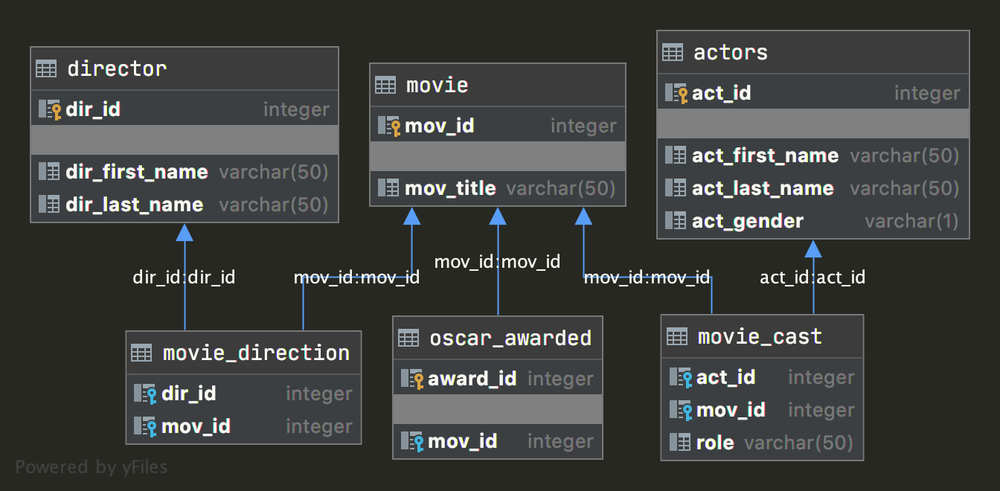

## Типы связей между таблицами в схеме

| Тип связи | Таблица 1 | Таблица 2 |
|:---------:|-----------|-----------|
|           |           |           |

## Связи в данной схеме

### 1. director — movie_direction
Связь: один ко многим.

Один режиссёр может иметь несколько записей в таблице `movie_direction`, каждая из которых связывает его с конкретным фильмом.

### 2. movie — movie_direction
Связь: один ко многим.

Один фильм может иметь несколько записей в таблице `movie_direction`, если у фильма несколько режиссёров.

### 3. director — movie
Связь: многие ко многим.

Реализуется через таблицу `movie_direction`.  
Один режиссёр может снимать много фильмов, и один фильм может иметь нескольких режиссёров.

### 4. actors — movie_cast
Связь: один ко многим.

Один актёр может иметь несколько записей в таблице `movie_cast`, то есть сниматься в нескольких фильмах.

### 5. movie — movie_cast
Связь: один ко многим.

Один фильм может иметь несколько записей в таблице `movie_cast`, то есть в фильме может сниматься несколько актёров.

### 6. actors — movie
Связь: многие ко многим.

Реализуется через таблицу `movie_cast`.  
Один актёр может сниматься во многих фильмах, и в одном фильме может быть много актёров.

### 7. movie — oscar_awarded
Связь: один ко многим.

Один фильм может иметь несколько наград, а каждая запись в таблице `oscar_awarded` относится только к одному фильму.

## Пять основных видов связей между таблицами

1. Один к одному.
2. Один ко многим.
3. Многие к одному.
4. Многие ко многим.
5. Рекурсивная связь.